# Arquitetura da Ontologia LogisBrito

## Visão Geral

A ontologia LogisBrito é estruturada em **6 eixos conceituais** que modelam os elementos fundamentais de conflitos urbanos em Recife. Cada eixo representa uma dimensão do problema, e as relações entre eles permitem capturar a complexidade das dinâmicas urbanas.

## Os 6 Eixos Conceituais

### 1. **Agentes Urbanos** (`AgenteUrbano`)
Atores que executam ações no espaço urbano.

### 2. **Ações Urbanas** (`AcaoUrbana`)
Intervenções concretas realizadas pelos agentes (propositivas ou impeditivas).

### 3. **Instrumentos** (`InstrumentoAcao`)
Ferramentas legais, administrativas ou técnicas usadas para executar ações.

### 4. **Espaços de Conflito** (`EspacoDeConflito`)
Territórios onde os conflitos se manifestam (ZEIS, centros históricos, etc.).

### 5. **Danos Urbanos** (`DanoUrbano`)
Consequências negativas das ações impeditivas.

### 6. **Benefícios Urbanos** (`BeneficioUrbano`)
Consequências positivas das ações propositivas.

---

## Hierarquia de Classes

A ontologia segue uma estrutura hierárquica clara, com classes abstratas no topo e especializações concretas abaixo.

```mermaid
graph TD
    AgenteUrbano[AgenteUrbano]
    AgenteUrbano --> PoderPublico[PoderPublico]
    AgenteUrbano --> Comunidade[Comunidade]
    AgenteUrbano --> AgenteMercado[Agente_de_Mercado]
    
    AgenteMercado --> InvestidorDesenvolvedor[Investidor_Desenvolvedor]
    AgenteMercado --> AgenteEspeculativo[Agente_Especulativo]
    
    AcaoUrbana[AcaoUrbana]
    AcaoUrbana --> AcaoPropositiva[Acao_Propositiva]
    AcaoUrbana --> AcaoImpeditiva[Acao_Impeditiva]
    
    DanoUrbano[DanoUrbano]
    DanoUrbano --> ArrecadacaoPerdida[Arrecadacao_Perdida]
    DanoUrbano --> CaosFuncional[Caos_Funcional]
    DanoUrbano --> DoencaMorte[Doenca_e_Morte]
    
    BeneficioUrbano[BeneficioUrbano]
    BeneficioUrbano --> ArrecadacaoAumentada[Arrecadacao_Aumentada]
    BeneficioUrbano --> OrdemFuncional[Ordem_Funcional]
    BeneficioUrbano --> DignidadeSocial[Dignidade_Social]
    
    EspacoDeConflito[EspacoDeConflito]
    EspacoDeConflito --> ZEIS[ZEIS]
    EspacoDeConflito --> CentroOcioso[Centro_Ocioso]
    
    InstrumentoAcao[InstrumentoAcao]
    InstrumentoAcao --> PEUC[PEUC]
    InstrumentoAcao --> OODC[OODC]
    
    style AgenteUrbano fill:#e1f5ff
    style AcaoUrbana fill:#fff4e1
    style DanoUrbano fill:#ffe1e1
    style BeneficioUrbano fill:#e1ffe1
    style EspacoDeConflito fill:#f0e1ff
    style InstrumentoAcao fill:#ffe1f5
```



---

## Propriedades de Objeto e Restrições

As propriedades de objeto conectam os 6 eixos, criando uma rede semântica que captura as relações causais e lógicas.

### Propriedades Principais

| Propriedade | Domain | Range | Descrição |
|-------------|--------|-------|-----------|
| `executaAcao` | `AgenteUrbano` | `AcaoUrbana` | Agente executa uma ação |
| `utilizaInstrumento` | `Acao_Propositiva` | `InstrumentoAcao` | Ação propositiva usa um instrumento legal |
| `causa_direta` | `Acao_Impeditiva` | `DanoUrbano` | Ação impeditiva causa um dano |
| `gera_beneficio` | `Acao_Propositiva` | `BeneficioUrbano` | Ação propositiva gera um benefício |
| `e_reversao_de` | `BeneficioUrbano` | `DanoUrbano` | Benefício reverte um dano |
| `em_antagonismo_com` | `AgenteUrbano` | `AgenteUrbano` | Agentes em conflito (simétrica) |

### Restrições de Domain e Range

As restrições de **domain** e **range** garantem que as propriedades sejam usadas corretamente:

- **`causa_direta`** só pode ser usada por instâncias de `Acao_Impeditiva` (domain) e só pode apontar para `DanoUrbano` (range).
- **`gera_beneficio`** só pode ser usada por `Acao_Propositiva` e só pode apontar para `BeneficioUrbano`.

Essas restrições permitem que o reasoner **detecte inconsistências** automaticamente. Por exemplo, se uma ação for declarada como `Acao_Propositiva` mas usar `causa_direta`, o reasoner identificará uma violação lógica.

---

## Instâncias Principais

A base de conhecimento atual modela o **conflito urbano do Coque**, uma ZEIS em Recife ameaçada por gentrificação.

### Agentes

| Instância | Tipo | Descrição |
|-----------|------|-----------|
| `Prefeitura_do_Recife` | `PoderPublico` | Poder público municipal |
| `Comunidade_do_Coque` | `Comunidade` | Moradores da ZEIS Coque |
| `Agentes_Especulativos_da_Orla` | `Agente_Especulativo` | Especuladores imobiliários |

### Ações

| Instância | Tipo | Descrição |
|-----------|------|-----------|
| `Acao_Propor_Lei_PREZEIS_1995` | `Acao_Propositiva` | Criação da lei de proteção de ZEIS |
| `Acao_Sancionar_Lei_18772_2020` | `Acao_Impeditiva` | Lei do Remembramento (facilita gentrificação) |
| `Acao_Omitir_Fiscalizacao_PREZEIS` | `Acao_Impeditiva` | Inação do poder público |

### Instrumentos

| Instância | Tipo | Descrição |
|-----------|------|-----------|
| `Lei_do_PREZEIS_1995` | `InstrumentoAcao` | Lei municipal de proteção de ZEIS |
| `Lei_do_Remembramento_2020` | `InstrumentoAcao` | Lei que permite unificação de lotes |

### Espaços

| Instância | Tipo | Descrição |
|-----------|------|-----------|
| `ZEIS_Coque` | `ZEIS` | Zona Especial de Interesse Social do Coque |

### Danos

| Instância | Tipo | Descrição |
|-----------|------|-----------|
| `Risco_de_Gentrificacao_Coque` | `DanoUrbano` | Ameaça de expulsão da comunidade |

---

## Restrições `disjointWith` e Detecção de Conflitos

As restrições **`disjointWith`** são fundamentais para a detecção automática de conflitos lógicos.

### Restrições Definidas

1. **`Acao_Propositiva` disjoint with `Acao_Impeditiva`**
   - Uma ação não pode ser simultaneamente propositiva e impeditiva.
   - Isso permite detectar contradições na modelagem.

2. **`Investidor_Desenvolvedor` disjoint with `Agente_Especulativo`**
   - Um agente de mercado não pode ter ambos os papéis ao mesmo tempo.
   - Isso força uma classificação clara dos atores.

### Como o Sistema Detecta Conflitos

O reasoner OWL DL usa as restrições `disjointWith` para:

1. **Validar Consistência:** Se uma instância for declarada como membro de duas classes disjuntas, o reasoner detecta uma **inconsistência lógica**.

2. **Inferir Contradições:** Se um agente executa ações de classes opostas (propositiva E impeditiva), o sistema identifica **ambiguidade comportamental**.

3. **Rastrear Causalidade:** Seguindo as propriedades `causa_direta` e `e_reversao_de`, o sistema mapeia cadeias de causa-efeito.

### Exemplo: Ambiguidade da Prefeitura

A Prefeitura do Recife executa:
- `Acao_Propor_Lei_PREZEIS_1995` (Acao_Propositiva) → protege o Coque
- `Acao_Sancionar_Lei_18772_2020` (Acao_Impeditiva) → facilita gentrificação

Embora a Prefeitura não seja inconsistente (ela não é simultaneamente uma ação), suas **ações são contraditórias**. A consulta SPARQL "Atores Ambíguos" detecta esse padrão, revelando a **ambiguidade do poder público**.

---

## Inferência OWL DL

O reasoner `owlrl` expande o grafo deduzindo novos fatos a partir das regras OWL:

### Regras de Inferência Aplicadas

1. **Transitividade de Subclasses:**
   - Se `Prefeitura_do_Recife` é `PoderPublico` e `PoderPublico` é subclasse de `AgenteUrbano`, então `Prefeitura_do_Recife` é `AgenteUrbano`.

2. **Propagação de Propriedades:**
   - Se `executaAcao` tem domain `AgenteUrbano`, então qualquer sujeito de `executaAcao` é inferido como `AgenteUrbano`.

3. **Validação de Restrições:**
   - Se uma propriedade viola domain/range, o reasoner detecta inconsistência.

### Exemplo de Tripla Inferida

**Antes da Inferência:**
```turtle
rec:Prefeitura_do_Recife a rec:PoderPublico .
```

**Depois da Inferência:**
```turtle
rec:Prefeitura_do_Recife a rec:PoderPublico, rec:AgenteUrbano .
```

---

## Extensibilidade

A arquitetura modular permite fácil expansão:

1. **Adicionar Novos Agentes:** Criar subclasses de `AgenteUrbano` (ex: `ONG`, `UniversidadeFederal`).
2. **Adicionar Novos Instrumentos:** Criar instâncias de `InstrumentoAcao` (ex: `Estatuto_da_Cidade`).
3. **Adicionar Novos Espaços:** Criar instâncias de `EspacoDeConflito` (ex: `ZEIS_Brasilia_Teimosa`).
4. **Adicionar Novas Consultas:** Implementar métodos em `SPARQLQueryEngine`.

---

## Referências Técnicas

- **OWL 2 Web Ontology Language Primer:** https://www.w3.org/TR/owl2-primer/
- **RDF 1.1 Turtle:** https://www.w3.org/TR/turtle/
- **SPARQL 1.1 Query Language:** https://www.w3.org/TR/sparql11-query/
- **owlrl Documentation:** https://owl-rl.readthedocs.io/
